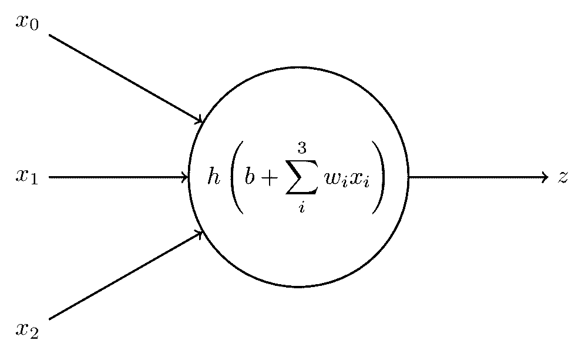
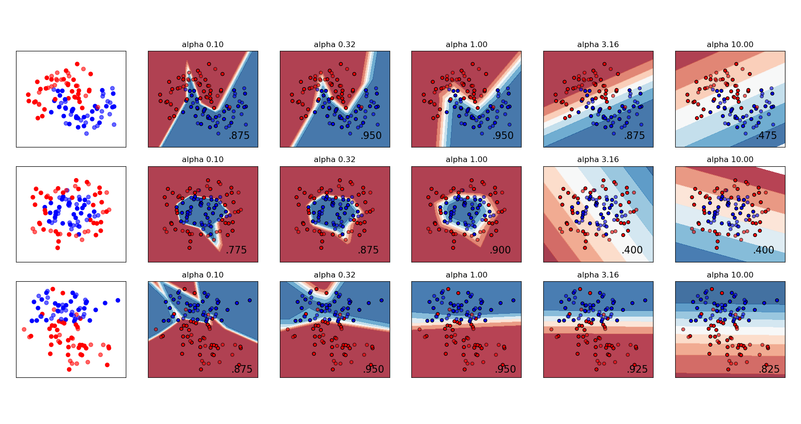

---
execute:
  cache: false
---

# Machine learning: decision trees and neural networks *(by S. Mæland)* {#sec-ml-decision-trees}


## Decision trees

"Decision trees" is the name given simple and intuitive machine learning models, which can be expanded and elaborated into a surprisingly powerful and general method for both classification and regression. They are based on the idea of performing a series of yes-or-no tests on the data, which finally lead to decision. **Note that they are not the same as the "decision trees" of [§@sec-decision-trees].**

We have already seen the tree-like structure for illustrating decision problems in @sec-basic-decisions, but in this section, we are doing similar yet different things. The name of "decision trees" still pertains to both, but it should hopefully be clear from context when we are talking about what. 

### Decision trees for classification on categorical values

For a trivial example, lets us say you want to go and spend the day at the beach. There are certain criteria that should be fullfilled for that to be a good idea, and some of them depend on each other. A decision tree could look like this:

```{dot}
//| label: fig-simple-decision-tree
//| fig-cap: A very simple decision tree.
digraph G {
    fontname="Helvetica,Arial,sans-serif";
    fontsize=15;
    node [fontname="Helvetica,Arial,sans-serif", penwidth=0.75, style="filled"];
    edge [fontname="Helvetica,Arial,sans-serif"];

    A[shape=box, label="  Go to the beach?  ", fillcolor="#edc6f5"];
    B[shape=diamond, label="Workday?", fillcolor="#eeeeee", height=0.7, width=1];
    C[shape=box, label="Don't go", fillcolor="#ffaaaa"];
    D[shape=diamond, label="Sunny?", fillcolor="#eeeeee", height=0.7, width=1];
    E[shape=diamond, label="Temp > 18ºC", fillcolor="#eeeeee", height=0.7, width=1];
    F[shape=diamond, label="Temp > 23ºC", fillcolor="#eeeeee", height=0.7, width=1];
    G[shape=box, label=" Go to the beach ", fillcolor="#aaffaa"];
    H[shape=box, label=" Don't go ", fillcolor="#ffaaaa"];
    I[shape=box, label=" Go to the beach ", fillcolor="#aaffaa"];
    J[shape=box, label=" Don't go ", fillcolor="#ffaaaa"];

    A -> B [style="invis"];
    B -> C [label="Yes"];
    B -> D [label="No"];
    D -> E [label="Yes"];
    D -> F [label="No"];
    E -> G [label="Yes"];
    E -> H [label="No"];
    F -> I [label="Yes"];
    F -> J [label="No"];
}
```

Depending on input data such as the weather, we end up following a certain path from the *root* node, along the *branches*, down to the *leaf* node, which returns the final decision for these given observations. The botany analogies are not strictly necessary, but at least we see where the name decision *tree* comes from. 

Studying the above tree structure more closely, we see that there are several possible ways of structuring it, that would lead to the same outcome. We can choose to first split on the `Sunny` node, and split on `Workday` afterwards. Drawing it out on paper, however, would show that this structure needs a larger total number of nodes, since we always need to split on `Workday`. Hence, the most efficient tree is the one that steps through the observables in order of descending importance. 


The basic algorithm for buiding a decision tree (or *growing* it, if you prefer) on categorical data, can be written out quite compactly. Consider the following pseudo-code:
<!-- (ref https://www.cs.cmu.edu/~tom/files/MachineLearningTomMitchell.pdf)  -->

<pre><code>
<b>function</b> BuildTree(<i>examples, target_feature, features</i>)
  <span style="color: gray;">
  # <i>examples</i> is the training data
  # <i>target_feature</i> is the feature we want to predict
  # <i>features</i> is the list of features present in the data
  </span>
  <i>tree</i> ← a single node, so far without any label
  <b>if</b> all <i>examples</i> are of the same classification <b>then</b>
    give <i>tree</i> a label equal to the classification
    <b>return</b> <i>tree</i>
  <b>else if</b> <i>features</i> is empty <b>then</b>
    give <i>tree</i> a label equal the most common value of <i>target_feature</i> in <i>examples</i>
    <b>return</b> <i>tree</i>
  <b>else</b>
    <i>best_feature</i> ← the feature from <i>features</i> with highest Importance(<i>examples</i>)

    <b>for each</b> value <i>v</i> of <i>best_feature</i> <b>do</b>
      <i>examples_v</i> ← the subset of examples where <i>best_feature</i> has the value <i>v</i>
      <i>subtree</i> ← BuildTree(<i>examples_v</i>, <i>target_feature</i>, <i>features</i> - <i>{best_feature}</i>)
      add a branch with label <i>v</i> to <i>tree</i>, and below it, add the tree <i>subtree</i>
    
    <b>return</b> <i>tree</i>
</code></pre>

This is the original [**ID3**]{.blue} algorithm [@quinlan1986induction]. Note how it works recursively -- for each new feature, the function calls itself to build a subtree. 

:::{.column-margin}
The same algorithm is shown and explained in section 19.3 in Russell and Norvig, although they fail to specify that this is ID3.
:::

We start by creating a node, which becomes a *leaf* node either if it classifies all examples correctly (no reason to split), or if there are no more features left (not possible to split). Otherwise, we find the most important feature by calling `Importance(examples)`, and proceed to make all possible splits. Now, the magic happens in the `Importance` function. How can we quantify which feature is best to discriminate on? We have in sections @sec-infinite-populations and @sec-entropy-mutualinfo met a useful definition from information theory, which is the **Shannon entropy**:

$$
    H(f) \defd -\sum_{i} f_i\ \log_2 f_i\ \mathrm{Sh}
    \qquad\text{\midgrey\small(with \(0\cdot\log 0 \defd 0\))}
$$

where the $f_i$ are frequency distributions. If we stick to the simple example of our target features being "yes" or "no", we can write out the summation like so:

$$
    H = -(f_{\mathrm{yes}} \log_2 f_{\mathrm{yes}} + f_{\mathrm{no}} \log_2 f_{\mathrm{no}})\ \mathrm{Sh}
$$

Let us compute the entropy for two different cases, to see how it works. In the first case, we have 10 examples: 6 corresponding to "yes", and four corresponding to "no". The entropy is then

$$
    H(6\;\text{yes}, 4\;\text{no}) = -[(6/10) \log_2 (6/10) + (4/10) \log_2 (4/10)]\ \mathrm{Sh} = 0.97\ \mathrm{Sh}
$$

In the second case, we still have 10 examples, but nearly all of the same class: 9 examples are "yes", and 1 is "no":

$$
    H(9\;\text{yes}, 1\;\text{no}) = - [(9/10) \log_2 (9/10) + (1/10) \log_2 (1/10)]\ \mathrm{Sh} = 0.47\ \mathrm{Sh}
$$

Interpreting the entropy as a measure of impurity in the set of examples, we can guess (or compute, using $0\cdot \log_2 0 = 0$) that the lowest possible entropy occurs for a set where all are of the same class. When doing classification, this is of course what we aim for -- separating all examples into those corresponding to "yes" and those corresponding to "no". A way of selecting the most important feature is then to choose the one where we expect the highest reduction in entropy, caused by splitting on this feature. This is called the [**information gain**]{.blue}, and is generally defined as

$$
    Gain(A, S) \defd H(S) - \sum_{v \in Values(A)} \frac{|S_v|}{|S|} H(S_v) \,,
$$ {#eq-gain-categorical-features}

where $A$ is the feature under consideration, $Values(A)$ are all the possible values that $A$ can have. Further, $S$ is the set of examples, and $S_v$ is the subset containing examples where $A$ has the value $v$. Looking again at the binary yes/no case, it looks a little simpler. Using the feature `Sunny` as $A$, we get:

$$
    Gain(\texttt{Sunny}, S) = H(S) - \left(\frac{S_{\texttt{Sunny=yes}}}{S} H(S_{\texttt{Sunny=yes}}) + \frac{S_{\texttt{Sunny=no}}}{S} H(S_{\texttt{Sunny=no}})\right) \,.
$$

This equation can be read as "gain equals the original entropy *before* splitting on `Sunny`, minus the weighted entropy *after* splitting", which is what we were after. One thing to note about equation @eq-gain-categorical-features: while it allows for splitting on an arbitrary number of values, we typically [always want to split in two]{.red}, resulting in **binary trees**. Non-binary trees tend to quickly overfit, which why few of the successors to the ID3 algorithm allow this. The extreme case would be if a feature is continuous instead of categorical. For a continuous feature it is unlikely that the data will contain values that are identical -- probably many values are similar, but not identical to e.g. ten digits precision. ID3 would potentially split such a feature into as many branches as there are data points, which is maximal overfitting. Binary trees can of course overfit too (we will get back to this shortly), but first, let us introduce a similar algorithm that can deal with both continuous inputs, and continuous output.


### Decision trees for regression (in addition to classification)

The problem of continuous features can be solved by requiring only binary splits, and then searching for the optimal threshold value for where to split. Each node will then ask "is the value of feature $A$ larger or smaller than the threshold $x$"? Finding the best threshold involves going through all the values in data and computing the expected information gain. One could initially think that we need to consider all possible values that the data *could* take, but luckily we need only to consider the values the data *does* take, since the expected information gain has discrete steps for value where we move a data point from one branch to the other.

A second thing we would like to solve, is to not only have categorical outputs (i.e. do classification), but also continuous values (i.e. do regression). Looking again at the pseudocode for the ID3 algorithm, we see that once we have "used up" all the features, the label assigned to the final branch will be the majority label among the remaining examples. For continuous target values, the fix is relatively simple -- we instead just take the average of the values in the examples. These two solutions form the basis for the CART (*Classification and Regression Trees*) algorithm, which creates decision trees for any kind of inputs and outputs.

### Preventing overfitting

Again from the pseudocode of the ID3 algorithm, we see that the basic rules for building a tree will keep making splits until we have perfect classification, or until no more features are available. Perfect classification surely sounds good, but is in practice rarely attainable, and these rules will typically create too many splits and thereby overfit to the training data. 


##### Pruning and hyperparameter choices

The common approach to avoid this is in fact to just let it happen -- and then afterwards, go in and remove the branches that give the least improvement in prediction. Sticking with the biologically inspired jargon, we call this [*pruning*]{.blue}. We will not go into the details of this, but leave it as an illustration of how well-defined machine learning methods often need improvised heuristics to work. Other tweaks that are used in parallel include

* requiring a minimum number of training events in each end node, and
* enforcing a maximum *depth*, i.e. allowing only a certain number of subsequent splits.


##### Random forests

Training several decision trees on similar data tends to end up looking like figure @fig-bias-variance-tradeoff (c): they are sensitive to small variations in the data and hence have high variance. But while each individual tree can be far off the target, the *average* is still good, since the variations often cancel out. This can be the case for many types of machine learning methods. We can improve performance by defining a new [ensemble]{.blue} model $f(\mathbf{x})$ composed of several separate models $f_m(\mathbf{x})$,

$$
f(\mathbf{x}) = \sum_{m=1}^M \frac{1}{M} f_m(\mathbf{x}) \,,
$$

where the $f_m$ are trained on a randomly selected subset of the total data. Necessarily, the $f_m$ models will be highly correlated, so one can also train them on randomly selected subsets of features, in order to reduce this correlation. In the case of decision trees, the ensemble is (obviously) called a [random forest]{.blue}.

##### Boosting

A final trick for decision trees, which is [boosting]{.blue}. This is an important method that all high-performing implementations of random forests use, but it also relies on a lot of tedious math, so we will mostly gloss over it. The point is that we can create the ensemble iteratively by adding new trees one at a time, where each new addition tries to improve on the prediction by the existing trees. 

Starting with a single tree $f_1$, its predictions might be good, but not perfect. So when evaluated on the training data $\mathbf{x}$, there will be a difference between the targets $\mathbf{y}$ and the predictions $f(\mathbf{x})$, and this difference we typically call *residuals* $r$:

$$
\mathbf{r}_1 = \mathbf{y} - f_1(\mathbf{x})
$$

or if we re-write:

$$
\mathbf{y} = f_1(\mathbf{x}) + \mathbf{r}_1
$$

We want $\mathbf{r}$ to be as small as possible, but with a single tree, there is only so much we can do. The magic is to train a second tree $f_2$, not to again predict $y$, but to predict the residual $r_1$. Then we get 

$$
\mathbf{y} = f_1(\mathbf{x}) + f_2(\mathbf{x}) + \mathbf{r}_2
$$

with $r_2 < r_1$ (hopefully), resulting in an improved prediction. This *stagewise additive modelling* can be done until we see no further improvement, resulting in an emsemble model that typically outperforms a standard random forest approach. Several variants of the boosting algorithm exists, some of which are discussed in chapter 16.4 of the Murphy book. Here, the explanation of the different boosting variants are based on arguments about *loss functions*. We have not started looking into loss funtions yet, but this will be a topic in the next chapter. It can be useful to come back to the Murphy book after having gone through next chapter's material. 

### Software frameworks

We are about to start the programming exercises, so let us briefly discuss our options for the implementation. While coding a decision tree algorithm from scratch is not too technically challenging, it is an ineffective way to learn aboubt the its behaviour in practice, and we also do not have the time to so. Hence we will use ready-made frameworks. 

For decent-performing and easy-to-use frameworks, we suggest to use [`scikit-learn`](https://scikit-learn.org/stable/index.html) for Python, and [`tidymodels`](https://www.tidymodels.org/) for R. There are, however, plenty of alternatives, and you are free to choose whichever you like. 

For state-of-the-art boosted decision trees, we suggest [`XGBoost`](https://xgboost.readthedocs.io/en/stable/index.html), which regularly ranks among the best tree-based algorithms on the machine learning competitions at [Kaggle](https://www.kaggle.com/competitions), and is available for both Python and R.


:::{.callout-caution}
: 
In these exercises we will start out with simple 2-dimensional data, just so we can visualise what is going on, and then move to real-world dataset afterwards. 

#### Classification

Let us try to classify samples from two different populations, which we simply call `positive class` and `negative class`. **Follow the code examples in this notebook: [decision_tree_examples.ipynb](https://github.com/pglpm/ADA511/blob/master/other_code/decision_tree_exercises.ipynb)**. The exercises themselves are listed in the notebook, but are included here too:

@. Recreate the data with either very big separation between the classes, or very small, and observe how the decision surface changes.
@. In the documentation for `DecisionTreeClassifier`, lots of options are described. You'll noticed that we have already specified a non-default criterion. Try changing the other parameters, and again observe how the results differ. In particular, try setting `max_depth` and `min_samples_split` to small or big values.
@. Generate some separate test data, and plot those too. Does the default decision tree parameters give good results on the test data? Can you find better parameters to improve the class prediction for this example?
@. Finally, print out the splitting thresholds and the leaf contents for the entire tree. Does it match your expectation from looking at the decision boundary?

#### Regression 

Now, we want to try out decision trees for predicting continuous target values. We will leave you alone from the start, and only give you the recipe for generating the 1-dimensional data we want to predict:

```{python}
#| eval: false
rng = np.random.default_rng()   # If not done already
X = np.sort(5 * rng.uniform(size=(80, 1)), axis=0)
Y = np.sin(X).ravel()
Y[::5] += 3 * (0.5 - rng.uniform(size=16))
``` 

The execise is similar to the classification one:

@. Using `DecisionTreeRegressor`, vary the values of its parameters and observe the result.
@. Generate **test data** following the prescription above, and find optimal parameters that account for the fact that our data is prone to *outliers*.

#### Real-world dataset classification

Now that we understand how the tree-based models work, it is time to use them on an actual, higher-dimensional dataset. We will use the [Adult Income]{.green} dataset, which you have met already, to predict the binary outcome of people making more than $50,000 a year, depending on their education, line of work, and so on. 

The training data are here:
`https://github.com/pglpm/ADA511/raw/master/datasets/train-income_data_nominal_nomissing.csv`

As measure of how good the model's predictions are, use the [ratio of correct predictions]{.blue} (correct predictions divided by the number of examples), which is also known as *accuracy*. 

Once you have trained your model and computed the accuracy on **training** data, compute the accuracy also for **test** data:
`https://github.com/pglpm/ADA511/raw/master/datasets/test-income_data_nominal_nomissing.csv`

Which performs better -- the `DecisionTreeClassifier`, the `RandomForestClassifier` or the `GradientBoostingClassifier`? 

[*Optional:*]{.red}
To optimise the performance as far as possible, try one of the "latest" tree-based algoritm implementations, such as [XGBoost](https://xgboost.readthedocs.io/en/stable/), [LightGBM](https://lightgbm.readthedocs.io/en/stable/), or [TensorFlow Decision Forests](https://www.tensorflow.org/decision_forests).

:::


## Neural networks

Neural networks are performing extremely well on complex tasks such as language modelling and realistic image generation, although the principle behind how they work, is quite simple. 

The basic building block is a **node**, which receives some values as input, and computes a single output:


{width=400 fig-align="center" #fig-neural-network-node}

The output is computed from the inputs $x_0, x_1, \dots, x_N$, each of which is multiplied by a weight $w_1, w_2, \dots w_N$, and summed together along with an additional parameter $b$, which is typically called a *bias*. You can probably identify this step as good old linear regression:

$$
a = b + \sum_{i=0}^N w_i x_i \,.
$$

A key property to neural networks, however, is to introduce *nonlinear* relationships. This is done by evaluating the output from each node by an **activation function** $h$. The final output $z$ from the node is then

$$
z = h(a) = h \left( b + \sum_{i=0}^N w_i x_i \right)
$$ 

The activation function is typically rather simple -- the most popular is the rectified linear unit (ReLU), which propagates positive values but sets all negative values to zero:

$$
\text{ReLU}(x) = \max(0, x) \,.
$$

Various other possibilities for choice of activation function exists, as we will explore in the exercises later.

Armed with our simple node, let us assemble several of them into a network. Starting with, say, four nodes, all the input data will be used by each of them:
(todo) mention layers


Neural networks are great for several reasons. They can be arranged to work with practically any type of data, including *unstructured* data such as images or text, which is not neatly organised into a table of explicit feature values. Granted, this flexibility does not appear by (FIGURE) alone, but is due to clever additions to the network structure that is beyond the scope of our lectures. A more theoretical argument for neural networks comes from the [*universal approximation theorem*]{.blue}, which states that 

> A neural network with a single hidden layer can be used to approximate *any* continuous function to *any* precision.

This is a very powerful property, which is explained in understandable terms [here](http://neuralnetworksanddeeplearning.com/chap4.html) (the proof (CITE) is rather technical). But, as we know already, this only helps if we are trying to model something which has a functional relationship. 


### Training neural networks

Finding the optimal values of the model's parameters $\mathbf{w}$ is usually called to *train* the model. When we looked at polynomials in the machine learning introduction (@sec-ml-introduction) we did not talk about this yet, partly because polynomial models have a closed-form solution for the best parameters, meaning they can be computed directly. Since neural networks are nonlinear by design, analytic solutions are not available and we need a numerical approach; for instance: start with unsystematically chosen parameter values, then iteratively try to improve them.

#### Loss functions

The first step towards improving the parameters, is to define what improvement is. Ultimately, our goal is to make predictions about the data that equal the true values, which is to say, we want to minimise the difference between predictions $f(\pmb{x}, \pmb{w},  \text{true values }y)$. This difference can be formulated in several different ways, but in the case of regression, the most common is the sum of squared errors:

$$
L(\mathbf{w}) = \sum_{\text{data points } i} (f(\mathbf{x}_i, \mathbf{w}) - y_i)^2
$$

$L$ is called a [**loss function**]{.blue}, alternatively a *cost* function or an *error* function. With this in place, the training process becomes a minimisation problem:

$$
\underset{\mathbf{w}}{\mathrm{arg\,min}}\, L(\mathbf{w}) \,.
$$ {#eq-loss-minimisation}

To minimise the loss function we still need to apply it to some data $\mathbf{x}$, but we have not made this dependence explicit, since the data are "unchanged" throughout the minimisation process. 

As for any bounded function, the minimum can be found either where the [gradient](https://mathworld.wolfram.com/Gradient.html) $\nabla L(\mathbf{w})$ is zero, or where it does not exist. Solving this analytically is usually impossible, so we resort to a numerical solution -- iteratively taking steps in the direction of smaller loss. The crucial point in neural network training is that the loss function is differentiable with respect to the network parameters, meaning we can compute $\nabla L(\mathbf{w})$ and take steps in the negative (downwards) direction:

$$
    \mathbf{w}^{n+1} = \mathbf{w}^{n} - \eta \nabla L(\mathbf{w}^{n}) \,.
$$ {#eq-gradient-descent}

This is the method of [**gradient descent**]{.blue}. Here we have introduced a new hyperparameter $\eta$ called the *learning rate*, which controls how large each step will be. 

The process of actually adjusting the parameters in the correct direction is called [**backpropagation**]{.blue}, and involves first computing the value of $f(\mathbf{x}, \mathbf{w})$, and then stepping backwards through each layer of the network, recursively updating the parameters by using the derivative. This sounds very tedious, but can be done efficiently by *automatic differentiation*, i.e. letting a computer do it. Modern frameworks for neural network models require only to know the layout of the network, and will, as we shall see in the exercises, figure out the rest automatically.


#### Gradient descent

While we did not get into it earlier, the concept of defining a loss function and doing gradient descent, is in fact how the majority of machine learning algorithms are trained. Even for decision trees, which had their dedicated algorithm, we ended up with a loss minimisation task once we introduced boosting.

Straight-forward gradient descent as shown in equation {@eq-gradient-descent} can work fine for relatively simple models, but will stop at the first minimum it encounters. For a reasonably complicated network, the loss function landscape can be expected to have several local minima or saddle points, causing the method to get stuck in places with suboptimal parameters. Several improved algorithms aim to tackle this. 

 * *Stochastic* gradient descent updates the parameters through equation {@eq-gradient-descent} for only a subset of data at a time. This is more computationally efficient, and the stochastic element helps against getting stuck in a local minimum, since a local minimum for some subset of data might not be a minimum for a different subset.
 * *Adaptive* gradient methods use different learning rates per parameter, which is updated for each iteration.
 * *Momentum* methods remember the previous gradients and keeps moving in the same direction even through flat or uphill parts, like a massive rolling ball. 

All of the above can be combined, and the most common method of doing so is the Adaptive Moment Estimation (Adam) algorithm.

## Preventing overfitting - *regularisation*

In the previous chapter, we had several ways of limiting decision trees so they would not overfit to the training data. Many apply also here, but having introduced the concept of loss functions, we will add a general approach.

First, limiting complexity by tuning hyperparameters, is always an option. For a standard network, we can adjust the number of layers and the number of nodes per layer. Making good guesses about the architecture of the network is difficult, so a *hyperparameter search* is often necessary to develop a performant model. 

Secondly, similar to random forests, one can make ensembles of models, trained on subsets (with replacement) of the data. For neural networks, however, this is less common, since the network is sort of an ensemble by itself. But remember that for random forests we also randomly dropped some of the features during training. The equivalent for neural networks is to randomly drop *nodes*, by zeroing their output for a single training iteration. This is called **dropout**. 

Lastly, let us introduce general regularisation, which is based on modifying the loss function. This means it can be applied to any machine learning algorithm that minimises loss, and is not specific to the algorithm itself. What we want to do is to add a term in the loss function that penalises large parameter values. This way we do not need to restrict the explicit complexity of the model by changing the structure, but we rather restrict the "volume" the parameters can span out. The minimisation problem in equation {@eq-loss-minimisation} then becomes

$$
\underset{\mathbf{w}}{\mathrm{arg\,min}}\, L(\mathbf{w}) + \alpha ||\mathbf{w}||_p \,,
$$ {#eq-loss-with-regularisation}

where the last part is the regularisation term, whose strength is controlled by a new hyperparameter, $\alpha$. There are different ways of quantifying the values of the parameters $\mathbf{w}$ -- in the above equation we have written it generally as an $p$-norm, but to actually compute the value, we need to decide on which norm to use. The options are

 * $L^0$, or the zero norm: Defined as the number of parameters with non-zero values. Minimizing this would be similar to going into the model and removing parameters by hand. Unfortunately, as an optimisation task, this is extremely difficult and is just not a practical option.
 * $L^1$, which is the sum of the absolute values of the parameters: $||\mathbf{w}||_1 = \sum_i |w_i|$. This is in statistics known as *Lasso* regularisation. 
 * $L^2$, which is the Euclidean distance: $||\mathbf{w}||_2 = \sum_i w_i^2$. This is also known as *ridge* regularisation, and is perhaps the most commonly used. 

The `scikit-learn` [User Guide](https://scikit-learn.org/stable/modules/neural_networks_supervised.html) has a nice example showing the effect of $L^2$ regularisation for varying regularisation strength:

{fig-align="center" #fig-mlp-regularisation-sklearn}


:::{.callout-caution}
: 

@. **Regression**: Follow the code examples in this notebook: [neural_network_regression.ipynb](https://github.com/pglpm/ADA511/blob/master/other_code/neural_network_regression.ipynb)

@. **Classification**: Follow the code examples in this notebook: [neural_network_classification.ipynb](https://github.com/pglpm/ADA511/blob/master/other_code/neural_network_classification.ipynb)

@. **Real-world dataset classification**: 
Make another attempt on the [Adult Income]{.green} dataset, this time using neural networks. Can you beat the tree-based models from last week?
The training data are here:
`https://github.com/pglpm/ADA511/raw/master/datasets/train-income_data_nominal_nomissing.csv`, 
while the test data are here:
`https://github.com/pglpm/ADA511/raw/master/datasets/test-income_data_nominal_nomissing.csv`


:::
